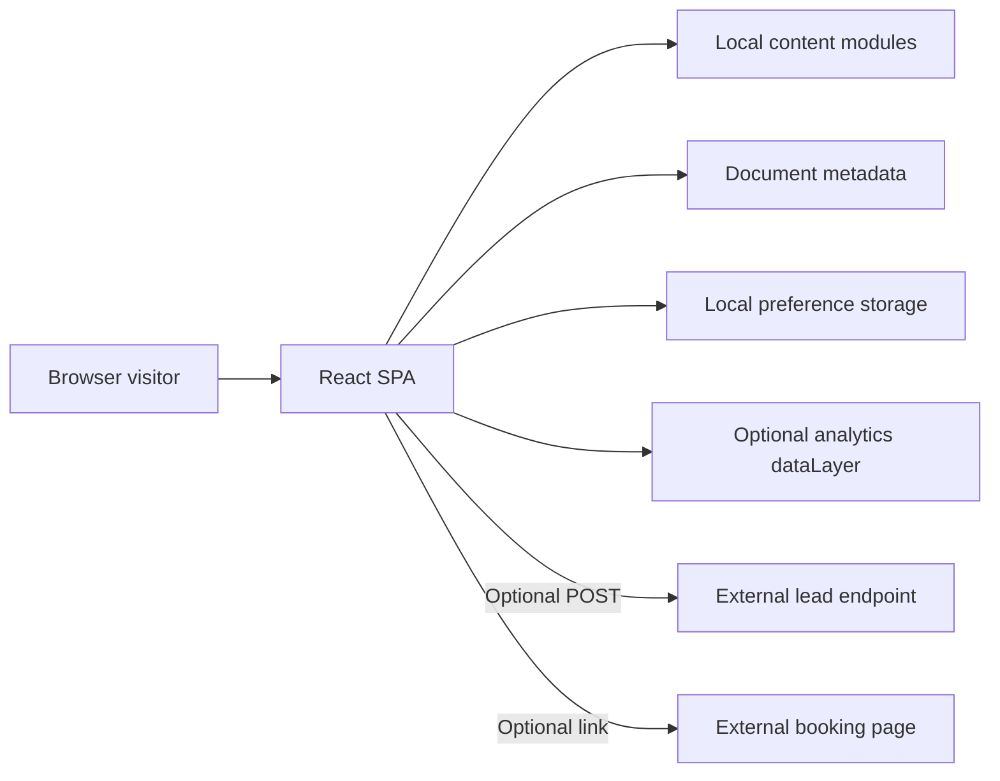

# Architecture

Last reviewed: 2026-09-04

## System Shape

Controllo Website is a client-rendered React 19 single-page application built by Vite 8. It is a marketing site, not the Controllo product application, and it contains no server, database, authentication, or privileged API credentials.

The production artifact is the static `dist/` directory. The host must serve `index.html` for unknown application paths so React Router can resolve deep links. `public/_redirects` provides this rule for compatible static hosts.

## Runtime Composition

`src/main.jsx` mounts the application in this order:

1. React strict mode
2. Browser router
3. `App`
4. Shared motion provider
5. Suspense and route registry
6. Shared site layout
7. Active route page

`src/App.jsx` is the route source of truth. Core pages are loaded immediately; lower-frequency marketing routes are lazy-loaded to create separate build chunks. Product route paths are derived from the product content registry so route and content additions cannot drift apart.

`SiteLayout` owns global behavior shared by every route:

- Shared header placement
- Skip link and main landmark
- Route transition animation
- Scroll restoration to the top
- Footer
- Cookie preference prompt

`SiteHeader` owns its responsive menu and dropdown state, including hover intent, keyboard focus, Escape and outside-click closing, route-family highlighting, and mobile scroll locking. `NavbarIntro` owns the one-time Signal Lock sequence; `HeaderCtaContent` owns the shared directional arrow and reduced-motion-aware shine used by the header and homepage hero primary actions while each caller owns its label and destination.

## Homepage Composition

`src/pages/HomePage.jsx` is the homepage-order source of truth. Its frozen sequence is:

1. Hero
2. Popular-framework marquee
3. Connected Platform
4. Secura AI
5. Focused Risk Management proof
6. Frameworks and Connectivity
7. Seven-Day Readiness Path
8. Blog
9. Final conversion

The shared footer follows the route content through `SiteLayout`. The complete approved surface is frozen in the design system's **Frozen Homepage Baseline**. Reordering, redesigning, adding sections, or changing homepage motion and CTA hierarchy requires an explicit request that reopens the affected surface. Accuracy, accessibility, legal, verified destination, release-critical responsive, and performance corrections remain permitted.

## Content Model

The site intentionally keeps content close to the frontend:

- `src/data/enterpriseContent.js` owns navigation, product pages, frameworks, integrations, resources, and footer groups.
- `src/data/brandAssets.js` is the runtime registry for locally hosted third-party brand marks; provenance and review status remain beside the files in `public/assets/brands/README.md`.
- `src/data/siteContent.js` owns homepage Connected Platform and Risk visualization data.
- `src/data/staticPages.js` owns company, security, privacy, terms, and accessibility content; `src/pages/StaticPage.jsx` only composes the shared presentation.
- `src/pages/PricingPage.jsx` currently owns package comparison content locally.

There is no CMS. Content changes are source changes and require a build/deploy cycle. Existing objects in `src/data/` are the source of truth for content shapes.

Framework and resource detail pages use module-level slug maps exported through selector functions instead of scanning their collections during every render. Directory filter options are also derived once when the content module loads. `DirectoryControls` owns the shared search field and filter-chip behavior used by framework, integration, and resource directories.

Static arrays and reusable render components stay at module scope. Do not add memoization around trivial expressions; introduce deferred rendering, pagination, or remote-data caching only when collection size or a future API makes the cost measurable.

### Dedicated Cybersecurity Route

`src/pages/CybersecurityPage.jsx` owns metadata and the ordered six-section composition for `/solutions/cybersecurity`. `src/data/cybersecurityContent.js` owns the route's core approved narrative, metadata, and configured content arrays; small presentational labels and illustrative UI states may remain local to the section that renders them. The route is lazy-loaded explicitly in `src/App.jsx` and is intentionally excluded from the generic `productPages` registry.

Each route-owned section controls one visual system: Assurance Horizon, Response Matrix, Review Dossier, Operational Monitoring Console, Shared-Control Field, or Kinetic Brand Mosaic. The Shared-Control Field is a pointer-inert mapping loom rather than another dashboard: three reusable control rows meet the Controllo emblem and branch into eight visible framework entries, while the sole framework-directory action remains outside the illustration. Its desktop grid gives the emblem a widened middle track and right-aligns it so the control-to-hub and hub-to-spine spans remain visually balanced; the stacked mobile layout centers the emblem. The measured framework spine sits midway between the two inner-facing endpoint columns. Every row owns one junction and two straight mirrored stubs; left labels precede their right-edge dots, while right labels follow their left-edge dots. One overlay SVG derives a 1:1 viewBox and every path from measured DOM anchors. A signature-guarded post-commit measurement plus a requestAnimationFrame-debounced `ResizeObserver`, window resize listener, and post-font-load pass keep endpoints aligned through hot layout changes, breakpoints, zoom, and text wrapping without causing render loops. The viewport GSAP sequence draws those measured paths once, briefly resolves each endpoint, and then becomes still. The reduced-motion fallback renders the complete diagram statically. The closing Kinetic Brand Mosaic keeps the official emblem as the right-side focal point without a dashboard, cards, labels, or connector geometry. Twenty-one translucent white, mint-soft, and mint glass fragments assemble into a controlled depth cloud around the exact emblem. A quieter navy-teal background preserves copy contrast while a right-weighted aurora, organic mist, localized halo, subtle grain, and grounded shadow concentrate depth behind the mosaic. GSAP assembles the fragments and emblem once on viewport entry, then limits ambient motion to slow aurora, mist, halo, and fragment displacement while the section remains visible. Reduced motion renders the complete mosaic statically. The Operational Monitoring Console keeps its three keyboard-operated views in one stable desktop frame. Each view pairs a navy source roster with a light monitoring workspace that derives source, signal, and review counts from its configured content, then separates current visibility from the review queue without implying that operational monitoring changes compliance status. Exact third-party marks resolve through the local brand registry and `IntegrationLogo`. `MotionContext` supplies the operating-system motion preference; automated sequences settle, clean up timers/observers, and render complete static states under reduced motion. `SiteLayout` renders the first lazy route without a second opacity entrance so route-owned hero motion is visible immediately, while subsequent client-side route changes retain the shared transition.

`TrialLink` accepts only an absolute `http:` or `https:` `VITE_TRIAL_URL`. A missing, blank, malformed, relative, or non-web value renders an internal Router link to `/pricing`. The variable is public browser configuration and must never contain a secret.

Generic Product and Pricing pages no longer repeat FAQ content. Educational questions belong in the external article library; a future pricing-specific FAQ requires separately approved commercial answers.

### Dedicated AI Governance Route

`src/pages/AiGovernancePage.jsx` owns metadata and the ordered six-section composition for `/solutions/ai-governance`. `src/data/aiGovernanceContent.js` owns the route's approved AI-system, risk, Secura, framework, and conversion language. The route is lazy-loaded explicitly in `src/App.jsx` and is intentionally excluded from the generic `productPages` registry.

The route composition is:

1. Operational AI Governance hero and connected AI dossier
2. AI governance challenge-to-response ledger
3. AI system inventory and risk-assessment workflow
4. Secura AI control review
5. AI governance framework context and Controllo operating layer
6. AI Governance, Connected conversion

Both route-owned selectors change only through pointer or keyboard input and do not autoplay. `MotionContext` keeps entrance effects optional; reduced motion renders all six sections immediately in their complete settled state. Framework descriptions provide conservative context rather than claiming exact mappings, while evidence-dependent product, timing, framework, and company claims remain governed by `FS-016` in `docs/FUTURE_SCOPE.md`.

## Presentation and Motion

Tailwind CSS v4 utilities are colocated with the React markup that owns each layout, surface, state, and breakpoint. `src/styles.css` is intentionally limited to `@theme` tokens, global base rules, a small set of shared primitives, and effects that are clearer as CSS: keyframes, pseudo-elements, gradients, and visualization geometry. New component-specific spacing or responsive behavior belongs in JSX rather than a new stylesheet selector.

Motion uses `motion/react` plus CSS animation:

- `MotionContext` follows the operating-system reduced-motion preference.
- Components receive `motionEnabled` and must render a complete static state when it is false.
- Navbar and CTA entrances use opacity and transform-based motion; reduced motion removes their translation, scale, and decorative shine.
- `HeroSection` keeps the Focus Stack configuration at module scope, lazy-loads the heavy WebGL `WaveShader`, loads `/assets/dashboard.webp` once as eager decorative media, keeps foreground event cards/data static so the frozen hero does not introduce render churn, and reuses `HeaderCtaContent` for the primary CTA shine/icon behavior.
- `WaveShader` renders a decorative WebGL canvas and falls back to CSS when WebGL is unavailable.
- `SecuraAssessment` owns module-scope summary, metric, review-row, and recommendation configuration plus one shared viewport-triggered sequence for the compact packet identity, gap summary, metrics, rows, attention states, and final action tray. Its constrained panel remains centered across breakpoints, uses one shared fixed-height right-graphic frame for every phase, and reuses `CursorGrid`, whose `IntersectionObserver` runs the automatic Canvas 2D current only while at least 15% of the panel is visible. The Secura banner and recommendation tray dispatch only local replay phase changes, and the canvas uses the same origin-aligned 42px square geometry as the static CSS lattice. The grid releases both observers and its animation frame on cleanup; reduced motion omits the canvas while preserving the complete assessment and CSS lattice.
- `CursorGrid` caches parsed color values at module scope so the animation loop does not repeat the same conversion on every frame.

Visual changes must also follow `design-system/controllo-compliance-current/MASTER.md`.

## Browser Integrations

The demo form calls `LeadService.submit`:

- With no `VITE_LEAD_ENDPOINT`, it simulates success after a short delay.
- With an endpoint, it sends JSON using an unauthenticated browser `POST` request.
- On success, it pushes a `lead_submitted` event to `window.dataLayer`.
- If `VITE_DEMO_CALENDAR_URL` exists, the success screen offers the booking link.

The lead payload contains `name`, `email`, `company`, `size`, optional `role`, consent, the empty `website` honeypot, and `source: "enterprise-site"`. The external endpoint owns server-side validation, rate limiting, spam handling, CORS, storage, retention, and delivery. All `VITE_*` values are public browser configuration and must never contain secrets.

The cookie panel stores either `essential` or `accepted` under `controllo-consent` in `localStorage`. This preference currently controls only whether the panel is shown. It does not yet conditionally load or suppress analytics; that gap is tracked in `docs/ROADMAP.md`.

## Metadata and Discovery

`PageMeta` updates the title, description, Open Graph title/description/type, canonical URL, and `SoftwareApplication` JSON-LD after navigation. Canonical URLs use `https://controllo.ai` as the production origin.

Crawler-facing files are static:

- `public/robots.txt`
- `public/sitemap.xml`

Route additions require both the React route and relevant crawler entries to change together.

## Architectural Boundaries

- Keep secrets and privileged logic out of the website bundle.
- Put external lead validation, rate limiting, spam controls, storage, and notifications behind the configured lead endpoint.
- Keep product application concerns such as users, controls, evidence records, and audit workflows out of this repository unless they are presentational examples.
- Keep route-specific composition in `src/pages/`; shared behavior belongs in components, services, context, or data modules.
- Treat published claims and legal text as governed content, not placeholder UI copy.

## Known Constraints

- The site depends on JavaScript for route rendering and metadata updates.
- Social crawlers that do not execute JavaScript may see only the default `index.html` metadata.
- Google Fonts are imported from the public Google Fonts service at runtime.
- No error-monitoring or analytics vendor is installed.
- No CMS, localization system, authentication layer, backend, or end-to-end test suite exists.
